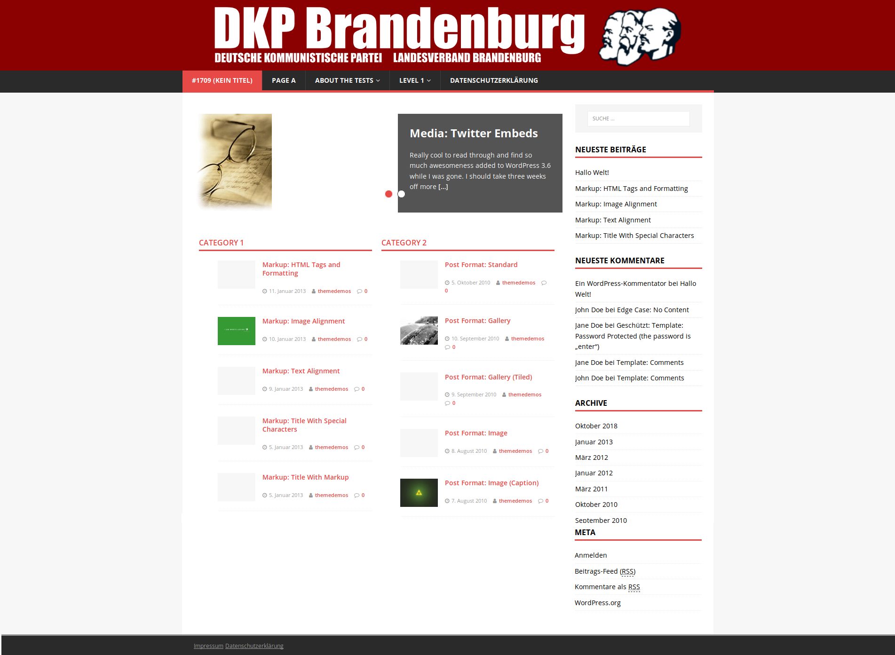

# DKP Next

This is a child theme for Wordpress based on [MH Magazine lite](https://www.mhthemes.com/themes/mh/magazine-lite/). It customizes the parent theme for the DKP* Brandenburg website.  
_*Deutsche Kommunistische Partei (German Communist Party)_

<!-- TOC -->

- [Example](#example)
- [Installing](#installing)
- [Authors](#authors)
- [License](#license)
- [Acknowledgments](#acknowledgments)

<!-- /TOC -->

## Example

## Installing

First download this repo as zip-file or clone and zip it yourself. In your Wordpress backend go to Themes > Add new theme > Upload theme. Then select the zip-file for upload. This installs the parent and child theme. Finally activate the theme.

## Authors

- **Fabian Große** - *Initial work* - [Saphareas](https://github.com/Saphareas)

See also the list of [contributors](https://github.com/Saphareas/DKP-Next/contributors) who participated in this project.

## License

This project is licensed under the GPLv3 License - see the [LICENSE](LICENSE) file for details

## Acknowledgments

Many thanks to [MH Themes](https://www.mhthemes.com/) for creating the parent theme and releasing it under the GPL2 license.
